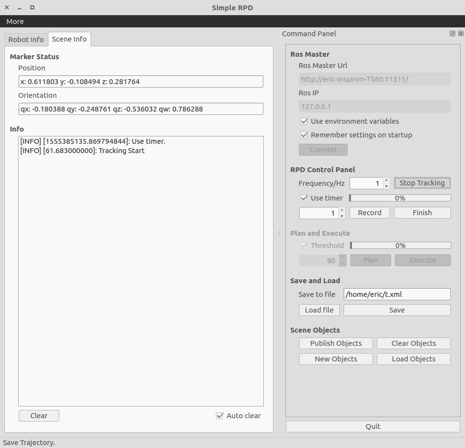

move_ur5_qt
==============================

****
|Author|ZhangHongda|
|------|-----------------|
|E-mail|2210010444@qq.com|
|Institute|Harbin Institute of Technology|
****

### Description
A graphical user interface designed for trajectory programming by demonstration for UR5 robot.
### Dependencies
- ROS kinetic
- Qt 5.9.1
### Preparations
* Install the [pcl_tracker](https://github.com/Zhang-Hongda/pcl_tracker) package and finish the preparation steps.
* Follow the installation guidance in [universal_robot](https://github.com/ros-industrial/universal_robot) package. 
* Install the [ur_modern_driver](https://github.com/Zhang-Hongda/ur_modern_driver) package if you are using a UR version 3.0 and above, and make sure the robot is well connected.
* The implementation of the system requires a Kinectv2 sensor (Kinectv1 is fine but you may need to modify some of the files in the [src](./src) folder). 
* The camera should be well calibrated and fixed on a shelf above the working platform (see also [iai_kinect2/kinect2_calibtation](https://github.com/code-iai/iai_kinect2/tree/master/kinect2_calibration)). 
* The extrinsic parameters of the camera in the frame of UR's base link shoud be published through tf messages.
### Installation
Step 1: clone the repository into your own workspace
```
cd ${PATH_TO YOUR_WORKSPACE_FOLDER}/src
git clone https://github.com/Zhang-Hongda/move_ur5_qt
```
Step 2: building
```
catkin_make
```
Step 3: activate the workspace
```
source ${PATH_TO YOUR_WORKSPACE_FOLDER}/devel/setup.bash
```
### Usage 
To start the program, first run:
```
roslaunch pcl_tracker demo.launch
```
Then run:
```
roslaunch move_ur5_qt move_ur5_qt.launch
```
### GUI
The interface should look like this:




