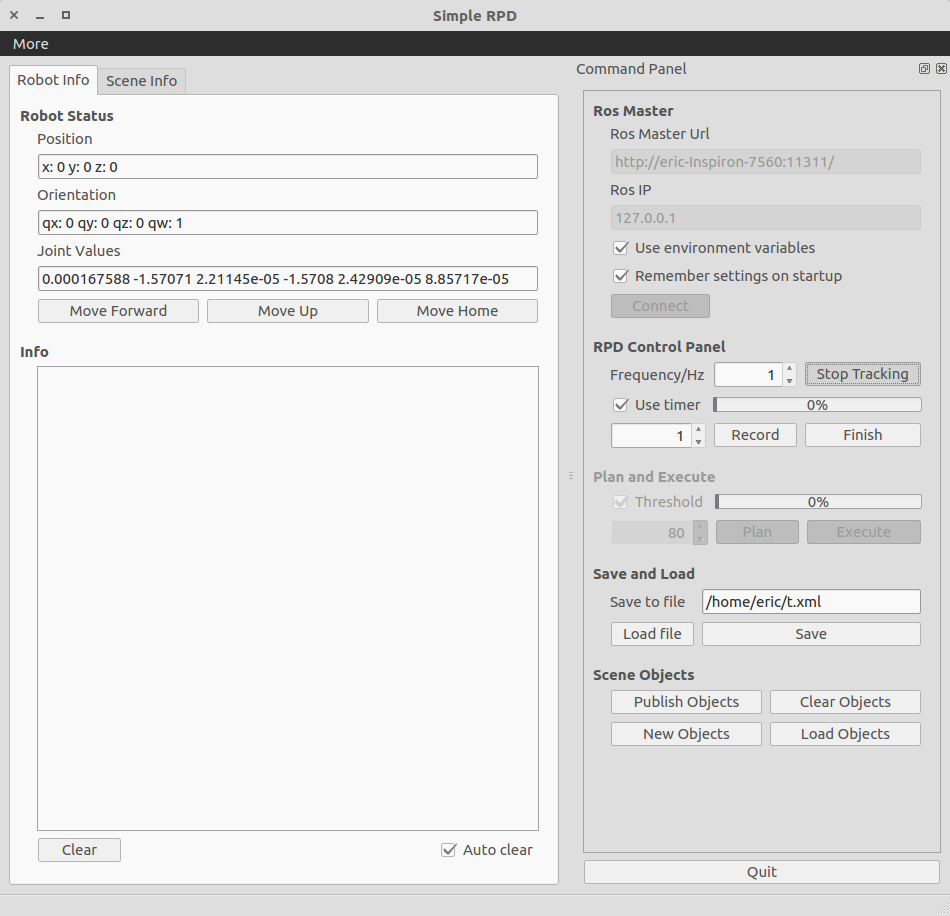
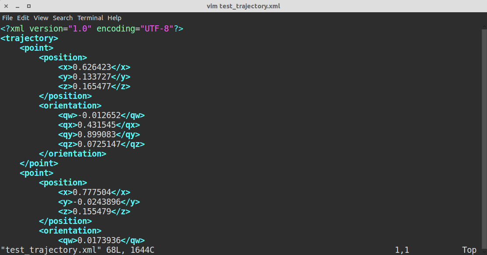
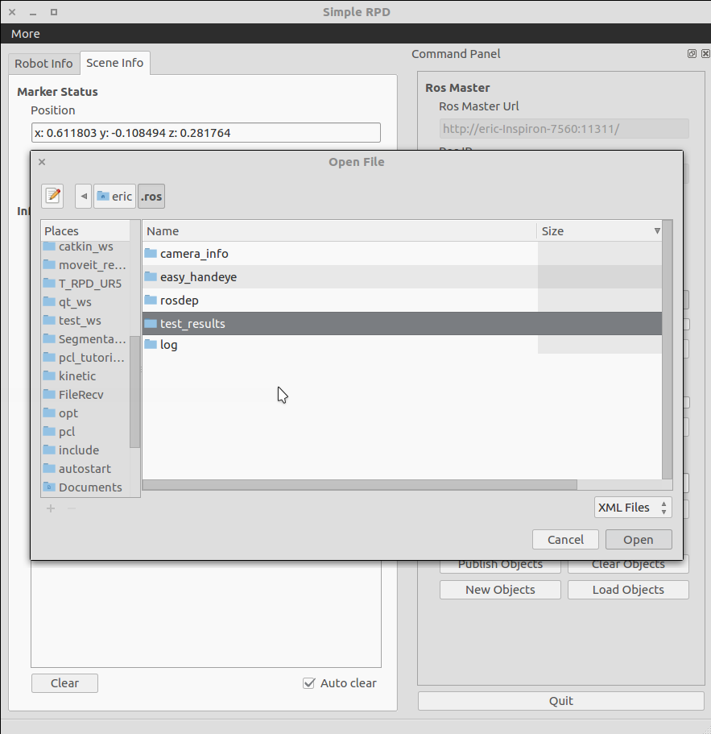
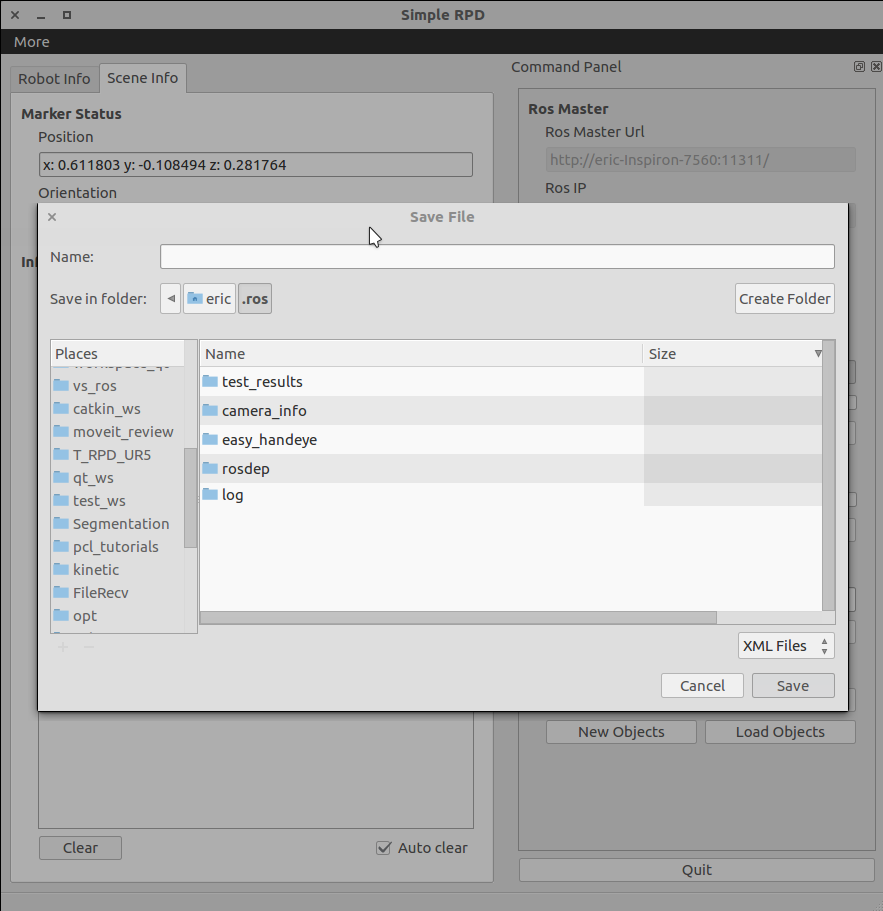

move_ur5_qt
==============================

****
|Author|ZhangHongda|
|------|-----------------|
|E-mail|2210010444@qq.com|
|Institute|Harbin Institute of Technology|
****

### Description
A graphical user interface designed for trajectory programming by demonstration for UR5 robot.
### Dependencies
- ROS kinetic
- Qt 5.9.1
### Preparations
* Install the [pcl_tracker](https://github.com/Zhang-Hongda/pcl_tracker) package and finish the preparation steps.
* Follow the installation guidance in [universal_robot](https://github.com/ros-industrial/universal_robot) package. 
* Add a new group_state named "forward".
    ```
roscd ur5_moveit_config/config
sudo gedit ur5.srdf
    ```
append the following content to the file.
```
<group_state name="forward" group="manipulator">
    <joint name="elbow_joint" value="1.5707" />
    <joint name="shoulder_lift_joint" value="-1.5707" />
    <joint name="shoulder_pan_joint" value="0" />
    <joint name="wrist_1_joint" value="-1.5707" />
    <joint name="wrist_2_joint" value="-1.5707" />
    <joint name="wrist_3_joint" value="0" />
</group_state>
```
* Modify the xacro file of UR5 robot. Append a fix link "pen" to "tool0" link.

    ```
roscd ur_description/urdf/
sudo gedit ur5.urdf.xacro
    ```
    append the following content at the end of the file:
    ```
<xacro:property name="pen_length" value="0.125" />
<link name="${prefix}pen"/>
<joint name="${prefix}tool0_fixed_joint-pen_fixed_link" type="fixed">
    <origin xyz="0 0 ${pen_length}" rpy="0 0 0"/>
    <parent link="${prefix}tool0"/>
    <child link="${prefix}pen"/>
</joint>
    ```
    __NOTE: __Modify the value of "pen_length" parameter according to actual condition.
* Install the [ur_modern_driver](https://github.com/Zhang-Hongda/ur_modern_driver) package if you are using a UR version 3.0 and above, and make sure the robot is well connected.
* The implementation of the system requires a Kinectv2 sensor (Kinectv1 is fine but you may need to modify some of the files in the [src](./src) folder). 
* The camera should be well calibrated and fixed on a shelf above the working platform (see also [iai_kinect2/kinect2_calibtation](https://github.com/code-iai/iai_kinect2/tree/master/kinect2_calibration)). 
* The extrinsic parameters of the camera in the frame of UR's base link shoud be published through tf messages. (see also [tf_base2camera](https://github.com/Zhang-Hongda/tf_base2camera) and [transform_publisher](https://github.com/Zhang-Hongda/transform_publisher)). 
### Installation
Step 1: clone the repository into your own workspace
```
cd ${PATH_TO YOUR_WORKSPACE_FOLDER}/src
git clone https://github.com/Zhang-Hongda/move_ur5_qt
```
Step 2: building
```
catkin_make
```
Step 3: activate the workspace
```
source ${PATH_TO YOUR_WORKSPACE_FOLDER}/devel/setup.bash
```
### Strat 
To start the program, first run:
```
roslaunch pcl_tracker demo.launch 
```
__NOTE:__ Modify the launch file if you don't want to use the [transform_publisher](https://github.com/Zhang-Hongda/transform_publisher) package to publish the extrinsic parameters.  

Then run:
```
roslaunch move_ur5_qt move_ur5_qt.launch
```
### GUI
The interface should look like this:


### Usage
*  The "__Robot Info__" tag displays information about the status of the robot and information concerning motion planning and execution
*  The "__Scene Info__" tag displays information about the pose of the marker in robot's frame and information concerning trajectory demonstration.
*  The command panel on the right allows users to control the trajectory programming process.
    * The "__Ros Master__" panel
        * Users can specify the __url__ and __ip__ for connecting the ros master.
        * Check "__Use environment variables__" if you want to use the environmental configuration of your computer (recommended).
        * Check "__Remember settings on stratup__" to allows the system to load the current configuration during startup next time.
        * 
    * The "__RPD Control Panel__"
        * To strat the tracking process, check the "__Start Tracking__" button.
        * The __frequency__ of capturing the tf messages of the marker can be modified in the spinbox (default value is 1 Hz).
        * To record the trajectory of the moving marker, click on "__Record__" button and move the marker along the desired trajectory.
        * Pause the recording process by clicking on "__Stop__" button.
        * Click "__Finish__" to indicate the termination of the trajectory demonstration process.
        * Check "__Use timer__" to allows the system to terminate the recording process automatically after countdown. The time of the countdown can be modified in the spinbox.
    * The "__Plan and Execute__" panel
        * After finishing the step of trajectory demonstration, users can plan and execute the recorded trajectory by clicking "__Plan__" and "__Execute__".
        * The motion planning and execution are implemented through [moveIT](https://moveit.ros.org/).
        * Check "__Threshold__" to set a threshold for the completion rate of the motion planning (default value is 80%).
    * The "__Save and Load__" panel
        * Users can save the recorded trajectory in a .xml file.
        
        * Users can load the trajectory file by clicking on the "__Load file__" button.
        
        * Modify the path in "__Save to file__" to specify the path for saving trajectory files.
        * If the path in "__Save to file__" is empty, a dialog will show up to help you find a path for saving files.
                
    * The "__Scene Objects__" panel
        * This panel allows users to add and delete collison objects in moveIT planning space.
        * By default, the system adds a table and a shelf in the space, but you may need to modify the models according to your own situation (a tutorial can be found at [Planning Scene ROS API](http://docs.ros.org/kinetic/api/moveit_tutorials/html/doc/planning_scene_ros_api/planning_scene_ros_api_tutorial.html#getting-started)).
        * The "New Objects" and "Load Objects" functions are currently in developing, which will allow users to draw 3D collision objects and place the objects in the planning space.
        * To avoid collision, you can also use [octomap](http://wiki.ros.org/octomap).

### videos
* A quick guidance of the developed system.
    * [](https://www.youtube.com/watch?v=YASbjS_zb-g)
* Trajectory programming by specifying five waypoints.
    * [](https://www.youtube.com/watch?v=F18YgKlDluw)
* Trajectory programming with a continuous curves
    * [](https://www.youtube.com/watch?v=5dFEKOuHhTA)


